# 🚀 SmartAI – End-to-End DevOps Capstone Project

<p align="center">

# SmartAI

### Cloud-Native DevOps Capstone Project

**AWS • Docker • Kubernetes • Terraform • GitHub Actions • ArgoCD • Prometheus • Grafana**

</p>

<p align="center">


</p>

---

# 📖 Project Overview

SmartAI is a web application designed to introduce users to Artificial Intelligence, explain AI concepts, and provide access to AI learning resources and courses.

This repository documents my **DevOps Capstone Project**, where my responsibility was to build and understand the complete DevOps lifecycle around the application.

Although the web application itself was provided as part of the capstone exercise, my focus was on designing and implementing the deployment pipeline, cloud infrastructure, automation, orchestration, monitoring, and operational workflow required to run the application using modern DevOps practices.

This project demonstrates my understanding of how software moves from development to production using cloud-native technologies.

---

# 🎯 Project Objectives

The primary objectives of this project were to:

- Understand modern DevOps workflows
- Build an automated CI/CD pipeline
- Containerize applications using Docker
- Provision cloud infrastructure using Terraform
- Deploy applications to Kubernetes (Amazon EKS)
- Implement GitOps using ArgoCD
- Configure monitoring with Prometheus and Grafana
- Gain practical experience with AWS cloud services
- Learn production-style deployment and troubleshooting

---

# 🏗️ DevOps Architecture

```mermaid
flowchart LR

A[Developer] --> B[GitHub Repository]

B --> C[GitHub Actions]

C --> D[Docker Build]

D --> E[Container Registry]

E --> F[Terraform]

F --> G[AWS Infrastructure]

G --> H[Amazon EKS]

H --> I[ArgoCD]

I --> J[SmartAI Application]

J --> K[Prometheus]

K --> L[Grafana Dashboard]
```



---

# ⚙️ Technology Stack

| Category | Technology |
|----------|------------|
| Version Control | Git & GitHub |
| CI/CD | GitHub Actions |
| Containerization | Docker |
| Infrastructure as Code | Terraform |
| Cloud | Amazon Web Services (AWS) |
| Orchestration | Kubernetes (Amazon EKS) |
| GitOps | ArgoCD |
| Monitoring | Prometheus |
| Visualization | Grafana |
| Operating System | Linux |

---

# 🚀 Deployment Workflow

The deployment process followed these steps:

1. Source code stored in GitHub
2. GitHub Actions triggered automatically
3. Docker image built successfully
4. Image pushed to the container registry
5. Infrastructure provisioned with Terraform
6. Kubernetes cluster deployed on AWS
7. SmartAI deployed into Kubernetes
8. ArgoCD synchronized the deployment
9. Prometheus collected metrics
10. Grafana displayed monitoring dashboards

---

# 📂 Repository Structure

```text
smart-ai/

├── .github/
│ └── workflows/

├── terraform/

├── kubernetes/

├── monitoring/

├── application/

└── README.md
```

> Update this structure if your repository differs.

---

# 👨‍💻 My Responsibilities

As part of this capstone project, I was responsible for:

- Managing source code using Git and GitHub
- Creating the CI/CD workflow
- Building Docker images
- Provisioning infrastructure using Terraform
- Deploying workloads into Kubernetes
- Configuring GitOps with ArgoCD
- Implementing monitoring using Prometheus
- Building dashboards in Grafana
- Testing deployments
- Troubleshooting deployment issues

---

# 🔍 Engineering Competencies Demonstrated

- Infrastructure as Code (IaC)
- Continuous Integration
- Continuous Deployment
- Kubernetes Administration
- Cloud Infrastructure
- Containerization
- Monitoring & Observability
- GitOps
- Automation
- Linux Administration
- Problem Solving
- DevOps Troubleshooting

---

# 🛠️ Troubleshooting & Lessons Learned

One of the biggest takeaways from this project was learning how to troubleshoot problems across different stages of a DevOps pipeline.

| Problem | Investigation | Resolution |
|----------|--------------|------------|
| Docker image build failed | Reviewed Docker build logs | Corrected Docker configuration and rebuilt successfully |
| GitHub Actions workflow failed | Checked workflow logs | Fixed workflow configuration and re-ran the pipeline |
| Terraform deployment issues | Ran `terraform plan` and reviewed output | Updated infrastructure configuration |
| Kubernetes deployment problems | Used `kubectl get`, `describe`, and `logs` | Corrected deployment configuration |
| ArgoCD synchronization issues | Compared desired vs live state | Synced the application successfully |
| Monitoring configuration | Verified Prometheus targets | Updated monitoring configuration and validated metrics |

Working through these issues helped me develop a more systematic approach to troubleshooting rather than relying on trial and error.

---

# 📸 Project Screenshots


Suggested screenshots:


---

# 📚 What I Learned

This project taught me that DevOps is much more than learning individual tools.

The real value comes from understanding how those tools work together to automate software delivery, improve deployment reliability, and create repeatable deployment processes.

More importantly, I learned that troubleshooting is one of the most valuable skills a DevOps Engineer can develop. Every deployment issue became an opportunity to improve my understanding of cloud infrastructure, automation, and system operations.

---

# 🚀 Future Improvements

If I continue developing this project, I would like to:

- Add Helm Charts
- Implement Blue-Green Deployments
- Implement Canary Deployments
- Add Security Scanning (Trivy)
- Integrate SonarQube Code Analysis
- Configure Alertmanager
- Add Loki for centralized logging
- Deploy with HTTPS and a custom domain
- Improve monitoring dashboards
- Implement automated rollback strategies

---

# 💼 About Me

Hi, I'm **Raymond J Faromoh**.

I'm a DevOps Engineer who enjoys building cloud infrastructure, automating deployments, and continuously improving my technical skills through hands-on projects.

I believe the best way to learn DevOps is by building real projects, documenting the journey, solving problems, and sharing knowledge with the community.

This repository represents one important milestone in my DevOps journey, and I look forward to building many more production-style projects.

---

# 🤝 Let's Connect

**GitHub:** https://github.com/Lloyd3312

**LinkedIn:** (https://www.linkedin.com/in/raymond-j-faromo-941400364/) 

---

# 🙏 Acknowledgement

The SmartAI web application was provided as part of a DevOps capstone exercise.

My responsibility was to design, implement, and understand the complete DevOps workflow surrounding the application—from source control and automation to cloud infrastructure, Kubernetes deployment, GitOps, monitoring, and troubleshooting.

This project reflects my hands-on learning and practical implementation of modern DevOps principles.

---

⭐ **Thank you for visiting this repository!**

If you found this project interesting, feel free to explore my other repositories as I continue documenting my journey toward becoming a Cloud & DevOps Engineer.
